# YourHealth: Better you, everyday!

This project is for tracking the overall physical, mental and financial health of an individual. 

Before commencing this project, a design stage was conducted and documentation was written. This included listing out the intended functionality, tech stack, user stories, drawing up wireframes and describing the planning methodology to be used for this project. 

The designing and planning documentation is located towards the end of this markdown file.


## Proposed Entity Relationship Diagram

- Each User can have multiple profile images, exercise log items, health insights, weekly sources of income and expenses, daily physical health records and goals.
- Each User can answer many questions for mental health surveys. The answer itself is made by one user for one particular question. Also a response option must be selected as part of each answer. 
- The survey questions belongs to one particular mental health survey and each question has its own question number.


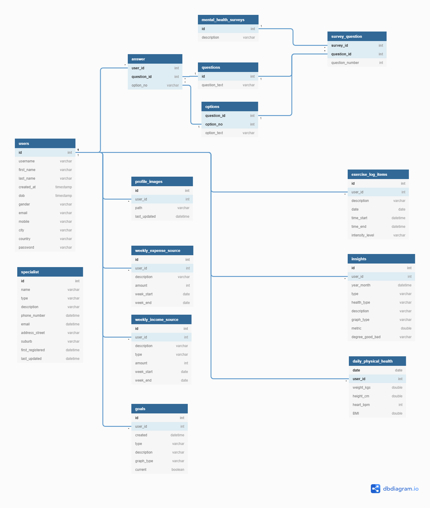


## Project Management (Trello Board)


The Trello board screenshots track my progress throughout the project. It covers the application development, testing and deployment process. Live Trello board link is [here](https://trello.com/b/8L3HnqxG/term-4-assignment-tasks).


### March 6

Lay out all the tasks for the YourHealth app and assign them all to the *To do List*. Also spin up an AWS EC2 instance and install a PostgreSQL database, ready to host database tables for the app.

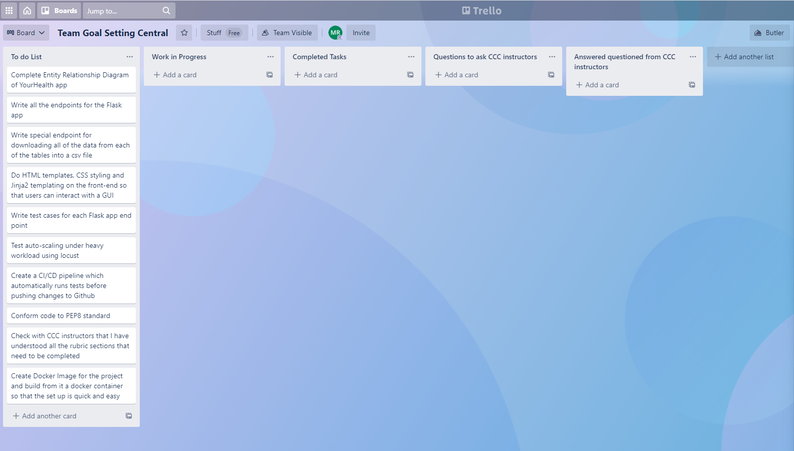


### March 7

All tasks have been laid out and development is almost ready to commence. An AWS EC2 has been spun up and is hosting a PostgreSQL database, however it currently does not contain any tables for our application. 

Before populating the database with tables for the app, an Entity Relationship Diagram is essential. This is especially needed for the *YourHealth* app because the mental health survey, question, option and answer tables have a complicated set of relationships between them. They also requiring implementing both **composite primary and foreign keys**, so careful attention to the development code is needed. This includes importing models in the correct order so that no circular imports arise. Also, composite foreign keys need to be linked to the correct table and have a unique constraint. Without this constraint, the database integrity will be undermined.


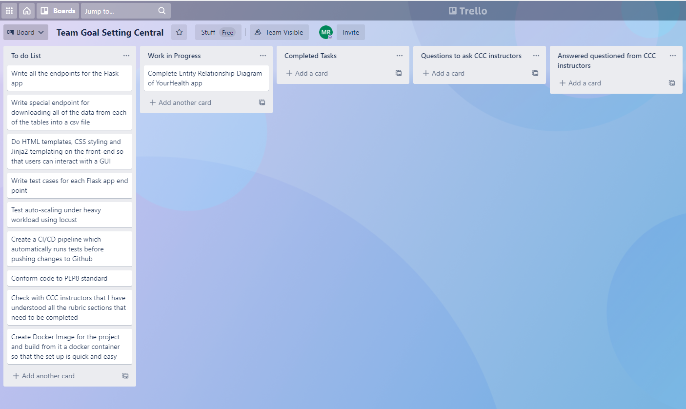


### March 8-9

The Entity Relationship Diagram has been completed. The primary key of each table is bolded and the various relationships between tables are clearly identified. It is now time to write all the **endpoints** of the Flask Application and test them out. Additionally, a special endpoint will be included which downloads all the data. Each database table will have its entries saved to a **separate csv file**. This is to ensure that an admin user can quickly check that all the entries in the database are correct.


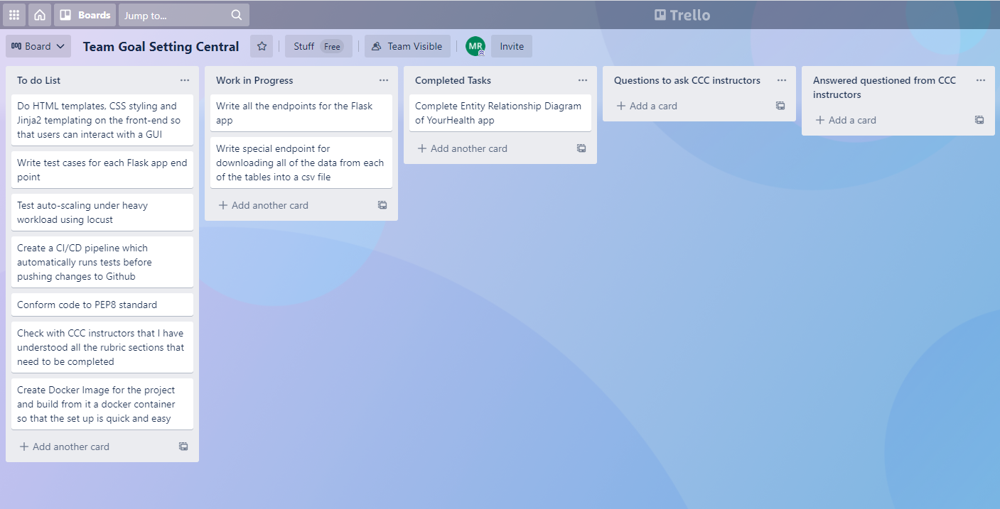


### March 10-11

All the end points are done, however there still remains the challenging task of setting up a CI/CD pipeline. Many errors were encountered when doing it so I have assigned this task as a question for the CCC instructors. I have written test cases for the users and the income and expense sources. However, it takes a few minutes to run locally so hopefully once the CI/CD pipeline is finished, those checks can be done on the cloud and more quickly.


### March 12

Asked the instructor about setting up the CI/CD pipeline. Many errors were encountered and have been listed in the manual testing spreadsheet. Once they were finished, a few more test cases were added since it is now much quicker to perform them in GitHub actions than locally on a computer.

Finally the HTML templates and CSS styling was done so that there is a GUI on the front-end.


## Source Control

I have made proper use of source control by committing and merging new features into the main branch. Here is a sample of the commits I made throughout the project that I would push to GitHub.


## Manual testing

For each controller, I verified that the json output was as expected. The excel file is located [here](./docs/manual_tests.xlsx).


## Automated Testing

Automated tests are located in the *src/tests* directory.

Every time changes are pushed to GitHub, automated tests are run.

To run the tests, cd into the *src* directory and run `python -m unittest discover -s tests/ -v` as seen below.


## CICD pipeline

The collections of jobs needed to continuous integrate and continuously deploy the app is located in the *.github/workflows* directory and is named *cicd.yml*. In the workflow, a test_suite is ran and the automated tests in the *src/tests* directory are triggered. If any test fails then the new code will not be successfully push to GitHub.

Once all the tests have been passed, then the new code is deployed on an EC2 instance in the AWS cloud. This is done by removing the old code and making a fresh clone of the repository in the EC2 instance. GitHub Actions allows for this process to be reviewed. Below the steps in the process can be seen.


## DRY principle examples

My flask application makes heavy user of functions so the same code is not repeated multiple times. Each controller has a **url prefix**. This ensures that the same word is not needlessly repeated at the start of each endpoint definition. Below is an example of the prefix being used in the *goal* controller.

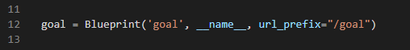


Each web controller has jinja templates that **inherit from the base.html file**. This ensures that the links for the google fonts, Bootstrap CSS, the title name and the authentication checks do not need to be re-written for each html page. Without inheriting code from the *base.html* file, a lot of code would need to be repeated, hence extending from the *base.html* file keeps the code dry.


In order to not repeat the same form, I have created a forms file which has **classes for each form**. This allows for **reusability** of forms throughout the application.


When **generating fake data**, the same code is used for creating new records to insert into the database. Therefore, I implement the **range function** on multiple occasions so that the code does not repeat itself multiple times.


## Description of libraries used

My code uses many different flask libraries for reasons including user authentication, migrating databases, validating data and hashing passwords. Below, I import several flask libraries into my application code.


The *flask_marshmallow* library is used to validate data inputted from the user. It ensures that the data types are correct, required fields are provided and the data passes validation checks. Here is an example below.


As can be seen above, the health type field can only accept 1 of the 3 values. This ensures that there are only 3 different kinds of health insights that the application will accept. Also the degree of good or bad for each insight is restricted to being 1 of 5 possible values.

Additionally, the datatype for each field is specified. Without datatype constraint, a string like "Feb 2021" would be accepted in the date field, even though its not in the proper date format.  By using datatype constraints, the *date* entered must indeed be a valid date. Without this data type constraint, the integrity of the database could be compromised. 

Also, the *date* is required and cannot be left empty. The schema above will raise an error if the new insight is missing a *date*. This makes sense to be required since each insight would need to be recorded on a particular date.


The *flask_jwt_extended* library is used to require users to provide an authentication token when using a particular endpoint. This ensures that the identity of the user is known to the endpoint function. In order to retrieve that identity from the token, the *get_jwt_identity* function is implemented. By using this library, I can easily record which user created each *weekly income source*.


Additionally, before deleting a *weekly income source*, I can verify that the user making the delete request is indeed the user who initially created it. Without this important check, a user could go into the app and delete any other user's data.


The *flask_migrate* library is used when making changes to the database tables. It automatically detects any differences between the tables in the current database and the tables in the newly changed database. The Flask-Migrate module stores the upgrade function needed to change the database from the previous to the current state it is in. Very importantly, it also ensures that the **current data is maintained**. This is critical because no data should be lost when making changes to our tables. The versions of the database are stored in the *versions* folder within the *migrations* directory so that there is a history of all the database changes.


The *flask_bcrypt* library is used for security purposes. It has the functions *generate_password_hash* and *check_password_hash* which are used in my app to ensure that plain text passwords do not need to be stored in a database table. Instead, the hashed password gets stored so that the plain text password can remain secret. 

This is done for the sake of the user and their own security. Many users reuse the same password on multiple applications. If their plain text password is exposed on just one of those applications, then all their other accounts on other applications would then become venerable. Therefore, to avoid this occurring, the hashed password is stored instead of the plain text password. 

Additionally, bcrypt is different to other hashing algorithms like MD5 and SHA1 in that bcrypt is deliberately structured to be slow. Therefore, it would take an enormous amount of time to try out all possible passwords and attempt to hack a user's account. The slow pace of the bcrypt algorithm makes it more secure. 

Below, the library's function *check_password_hash* is used to compare the hashed submitted password to the hashed user password. If they are not the same hash value, then the password submitted must be incorrect. 


The *flask_sqlalchemy* library is used for its object-relational mapper component. In my application, I used the ORM to map python classes into database tables. The ORM can appropriately convert python data types into PostgreSQL datatypes and vice-versa. Additionally, you can specify PostgreSQL database constraints, primary keys and foreign keys using Python code. The Flask application is clever enough to interpret the Python code and generate from it the corresponding PostgreSQL tables. 

Below, I specify that the PostgreSQL database should have a table named *answers*. In lines 9-14, I declare that there is a composite foreign key in the *answers* table and the composite foreign key is dependent upon the composite primary key in the *options* table. Moreover, I have declared the primary key in the *answers* table is to be comprised of the *user_id* and the *question_id*. The reasoning behind constructing this composite primary key is because a user can only respond to a question with one option. However a user can respond to multiple questions and a single question can be responded to by multiple users. Therefore, the composite primary key (user_id, question_id) is appropriate. 


## Utilises functions, ranges and classes

The application defines and uses many **classes**. Specifically, there are 15 classes used in total to define the PostgreSQL tables and a further 15 classes define for the schemas. Additionally, classes are implemented in the tests directory for testing purposes.


I used **ranges** many times in the application. For instance, when generating fake data records, I iterate through a range function to ensure that I don't unnecessarily repeat code. Below is an example where I generated fake data whilst iterating through a range object. Additionally, within the for loop, I use the *randrange* function from the *random* library. This function randomly samples a value from the range specified. For example, a person's height is commonly between 150cm and 200cm so I decided to sample from that range. 


Finally, **functions** are used throughout my application. For example, in my commands file, I use them to define terminal commands for dropping, creating and populating tables. 

In addition, **a special type of function called a** **decorator** is used with the @ symbol. A decorator is a function which wraps another function and modifies its behavior. Below the decorator is used to define what command is needed in order to execute the function. In line 6, the argument is "drop" which means that the *drop_db* function will only be returned and executed when the "drop" command is written. Likewise the *create_db* function will only be returned and executed when the "create" command is written.


## Installation

Steps:

1. Install python 3.8, python3.8-venv and python3-pip on your system.
   On Ubuntu run ```sudo apt install python3.8 python3.8-venv```
   Confirm installation occurred successfully by running ```python3.8 --version```

2. Install pip3 the python3 package manager.
   On Ubuntu run ```sudo apt-get install python3-pip```
   or ```python3 -m pip install pip```

3. Clone the app by running  ```git clone https://github.com/mrixon95/Term4_Assignment.git``` and cd into the newly cloned directory
   
4. On an Ubuntu OS, run the command ```python3 -m venv venv``` to download the venv module
   and ```source venv/bin/activate``` to activate the virtual environment.
5. The application has several dependencies which can be installed by running ```pip3 install -r requirements.txt``` within the virtual environment.


## Setup
Within the `src` folder, there is a ```.env.example``` template. Create a new file named`.env` and copy into it the contents of the `.env.example` file.  Finally, fill in the values of each variable to the right of the `=` sign.

## Custom Commands
These following flask commands below are for automating tasks related to database tables and for testing during the development phase.
1. ```flask db create```: creates database tables defined in registered models.
2. ```flask db seed```: populates database tables with dummy data using faker module.
3. ```flask db drop```: drops all database tables defined in registered models.


# CI/CD Pipeline


A CI/CD pipeline can be created as part of the continuous integration workflow when pushing modified code to GitHub.

1. The test_suite job will run on one of GitHub's VMs using the latest Ubuntu operating system. The new code pushed to GitHub is checked out into this VM.
2. The VM installs python3.8 and installs the dependencies. These dependencies and their version number are written on separate lines in the requirements.txt file.
3. The automated tests in the tests directory are ran 
4. The .py files are checked against the PEP8 style guide by running flake8


## Migrations

If you make any adjustments to the database tables eg. adding a new column to a table, then migrations are needed for recording those changes. The sqlachemy package```flask-migrate``` is in the requirements.txt file so no need to pip install it again.

To set it up:

1. Run `flask db init` and then drop everything in the database using ``` flask db-custom drop```
2. Create the migration using ```flask db migrate -m "Initial migration"``` and then run the migration using ```flask db upgrade```

You are now ready to make changes to the model that will automatically recorded every single time you migrate.


# Planning stage - T4A2 Full stack application Part A


## Website Description


### Purpose:

This project is designed to track the physical, mental and financial health of an individual. The analytics relating to the user's physical, mental and financial health should all be tracked and this information is to be displayed back to the user in an understandable way. Therefore, the purpose of YourHealth, is to assist the user in monitoring their overall health conditions and get a complete picture of all the significant factors that affect their health and wellbeing. Amongst other health and wellbeing metrics, it will be able to track the user's weight, diet, exercise routine, blood pressure, financial security and mental wellbeing. The intent of building YourHealth is to give the user a very clear picture of every factor that influences their health and wellbeing. Additionally, the app should clearly display how each factor has changed overtime so that user's can see which aspects of their health and wellbeing have been improving and deteriorating. 

For example, a user may well have changed diet, increased their amount of exercise and have lost 10 kg over the past 3 months. They report that feel a lot more energetic and have boosted their self-esteem. They report all of these good changes in their life into the YourHealth app. However, other factors in their life could have deteriorated. The cost of a gym membership and a dietician has caused significant financial distress on them and their performance at work is not as good because they have cut down work hours in order to go to the gym. 

The YourHealth app should account for all factors involved and deliver a clear picture to the user about their overall health and wellbeing profile. 


### Functionality:

**Allow users to enter in their health related data** - The YourHealth app features will allow users to enter in their general profile information along with health and wellbeing data. The general profile information will be obtained from the user when they sign up. They will enter in their name, age, email, date of birth and other profile information. Likewise, the health and wellbeing data will be obtained from the user on a frequent basis. This information includes their weight, diet, financial income and expenses, medication, exercise routine and other relevant data.

**Display graphs and information** - The YourHealth app will have a feature which displays all the relevant information that the user entered in a very understandable format. This feature will have line charts, bar charts, histograms, spider charts and many other powerful visuals that illustrate trends in the user's health and wellbeing over a period of time. Also correlations between metrics can be evaluated to show whether one metric has an affect on another eg. perhaps one user has a strong negative correlation between financial stress and time asleep. When the user is under financial stress, they tend to sleep less. Insights such as this would be of interest to the user and should be displayed to them.

**Highlight areas of significant improvement and deterioration** - There will be an insights page where the areas of significant improvement and deterioration are displayed. This page should be easy to read and the user should be able to immediately recognise which aspects of their health and wellbeing are getting better and which aspects are getting worse.

**Find contacts of specialists** - Users may want professional advice. In this case, there will be an contacts page where nutritionists, financial planners and personal trainers located near the user will have their contact details listed. 


### Target Audience:

The YourHealth app is designed for those people who find it difficult to track their health and wellbeing, or would like to see some insights into their health and wellbeing statistics. By inputting in all of their relevant health and wellbeing data, those users get clear insights into which aspects of their life are improving and alternatively, which aspects are deteriorating. Also correlations between factors can be viewed by the user so that they can see what may be causing the change in their health and wellbeing.


### Tech Stack:

I plan to build this application using a Python Flask App. This flask app will be made up of controllers which contains endpoints. These endpoints will be assessible through making HTTP requests to the flask server. The app will use **HTML**, **CSS** and **jinja2** on the **front-end**. This tech will be user-facing and display the graphical user interface to the end user. The jinja2 will enable the data retrieved from the PostgreSQL database, to be displayed to the user. On the **back-end**, a **PostgreSQL** **database** will be used to store all the user data in relational database tables. 

AWS will be used to spin up two **EC2 instances**. One EC2 instance will host the Flask application and accept traffic from any IP address on the internet. The other EC2 instance will host the PostgreSQL database where the user data is stored. For security reasons, only traffic from the EC2 instance with the Flask app will be accepted. This is to say that the database will not be able to receive queries from the wider internet. It will only be manipulated by the Flask app.

An **application load balancer** will be configured so that incoming traffic from users will be distributed across multiple EC2 instances. This ensures that there is never an overwhelming amount of requests made to a single EC2 instance. Instead, new EC2 instances can be spun up whenever the workload increases so that the response time of each request does not significantly deteriorate.

Finally, a **docker image and container** will be used to store all the instructions in setting up the Flask app and PostgreSQL database on separate EC2 instances. It should be very quick to start up the docker container and run the application.


## Data Flow Diagram


Ovals represent processes, squares represent user entities and the parallel horizontal lines represent a database table. 

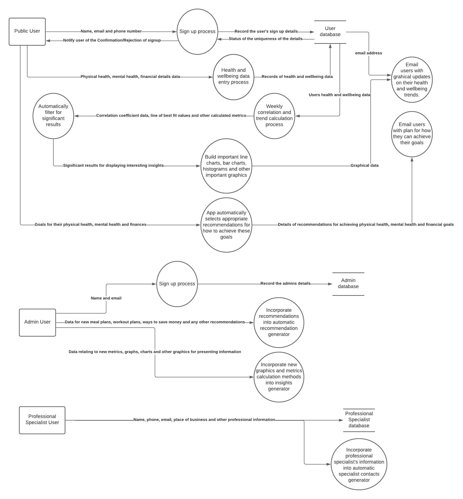


## Application Architecture Diagram

In my application, there will be at least one EC2 instance for the Python Flask Application and exactly one EC2 instance for hosting the PostgreSQL database. The inbound roles of the Database EC2 instance will be set so that only traffic from the application EC2 instance will be accepted. All other traffic that is not from the EC2 instance of the Flask App, will be rejected. This means that the database itself will only be accessible by the EC2 instance of the Flask Application. 

The Database EC2 instance will host a PostgreSQL. Therefore, the database EC2 instance must be able to send requests to the internet so that the PostgreSQL database itself is able to update itself by accessing new packages on the internet. It will be able to do this through a NAT gateway.

Additionally an Elastic Load Balancer will be used to direct user traffic to a particular Application EC2 instance. Incase there is a spike in traffic, auto scaling rules will be set so that new EC2 instances are spun up to host the Flask Application. The ELB ensure that workload is spread out across the application EC2 instances and that no single application EC2 is overwhelmed with traffic. Once the workload decreases again, the unnecessary EC2 instances can be terminated so that resources are not being wasted.


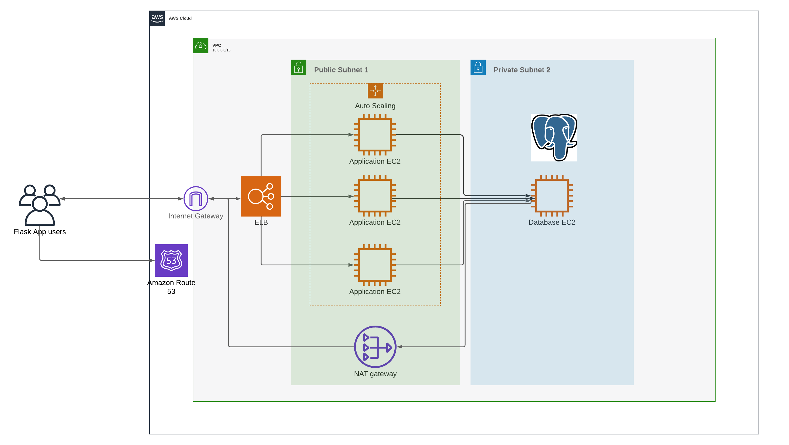


## User stories


1. As someone who wants to loose weight and eat healthier food, I want to find an exercise routine and meal plan, and track my progress, so that I remain committed to my goal weight and see how I progress after each week.
2. As a personal trainer, I want to advertise myself to people looking to lose weight, so that I can gain customers and make more business.
3. As a dietician, I want to help people with allergies to still eat healthy, tasty food. This way, I will gain more clients and help grow my brand.
4. As a poor university student, I am frequently running out of money. I want to be able to budget for all my expenses so that I don't need to borrow money from friends in order to pay my rent. 
5. As someone with mental health problems, I find myself unsure what parts of my life are causing me to feel down and depressed. I want to be able to track my level of wellbeing against my eating habits, exercise level and finances so that I can identify what leads me to feel depressed.


## Planning methodology using Trello board and Gantt chart


In order to plan out the tasks to complete for my Python Flask App, I will be using a Trello board. 

Normally, in a real company scenario, there would be things to do before planning out a project. The project manager in the team would need to **talk to all stakeholders** and understand the **objectives** of the client. Also there would be **budgetary constraints** and a quite limited time frame to work within. There would be a team of developers that must effectively work together to ensure that tasks are not duplicated and that their are no significant roadblocks towards completing a feature. Also there are **risks to prepare for** such as clients changing their requirements half-way through the project or a developer leaving before the project is finished.

Fortunately, this scenario just involves myself, the time constraint is not too strict (3 weeks is enough time to do a Flask app) and there are no important budget constraints to consider.

I will be using a **Trello board**. 

The lists in the trello board are as follows: To do list, Work in Progress, Completed Tasks, Questions to ask CCC instructors and Answered questions from CCC instructors

I believe that to effectively manage a project, I must track the completion of each task from beginning to end. This way, I don't need to rely on memory in order to remember where I am up to in the project. Specifically, it is important to track the tasks that I have not yet started, the tasks in progress and finally the tasks that have indeed been completed. Also, I expect that I will have questions to ask the CCC instructors in regards to my Flask app. Therefore I have a list for that along with the questions that have already received answers.


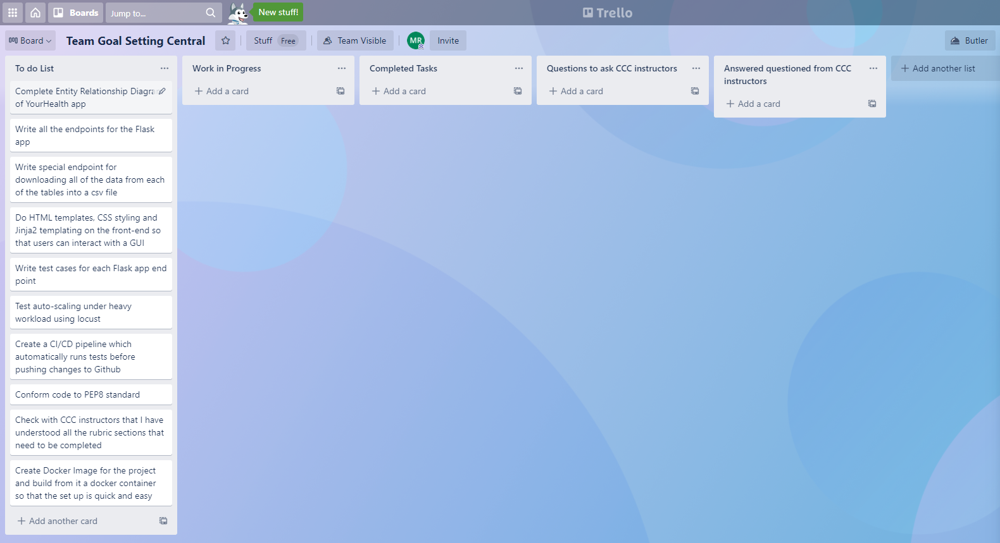


The trello board above tells me all the tasks that are to be completed in the project and their status. However, it doesn't say anything about how long each task should take and the level of difficulty in completing them. The trello board does not tell me how well I am tracking to my expected time frame. Therefore, I have decided to also use a Gantt chart.


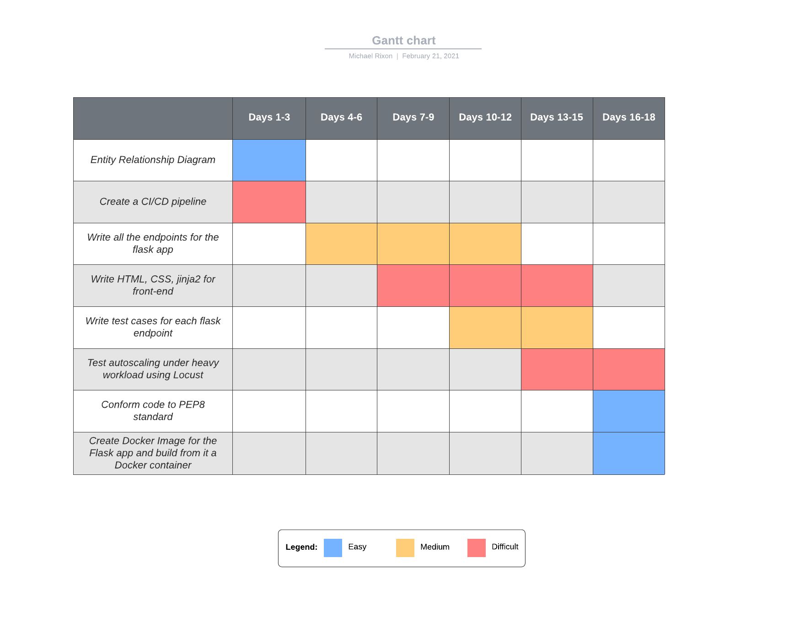

Clearly, the tasks of writing endpoints and completing the front-end are the two major tasks that will take up the most time. Also, I have limited front-end knowledge so I have indicated that the front-end will be difficult. The Gantt chart allows me to plan out more time for the endpoints and front-end since they are quite labor-intensive. It is important to have this time dedicated to those two tasks since I know that they can take a long time. On the other hand, conforming code to PEP8 standards just involves running Flake8 in each file and renaming variables to be more informative. Therefore, I only need to dedicate a few days to it at most.


## Wireframes


### Login Page

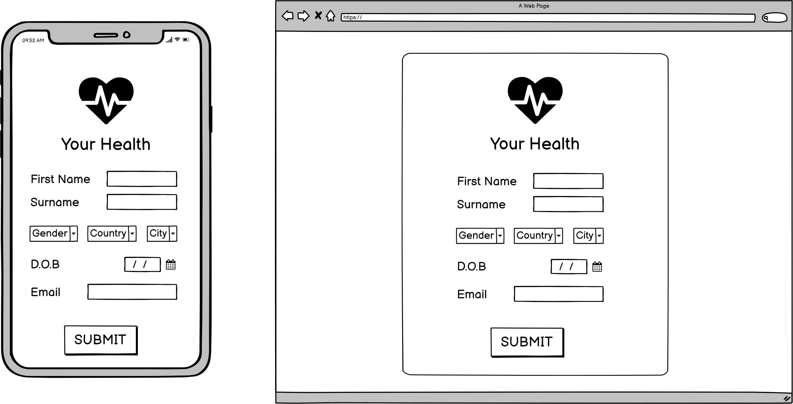


### Profile Page


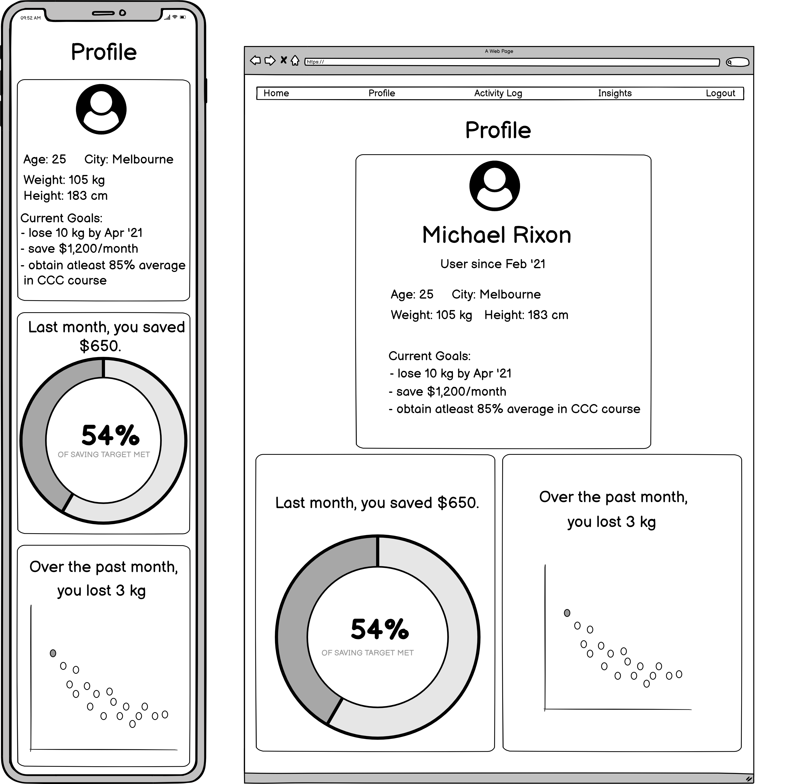


### Insights Page


### 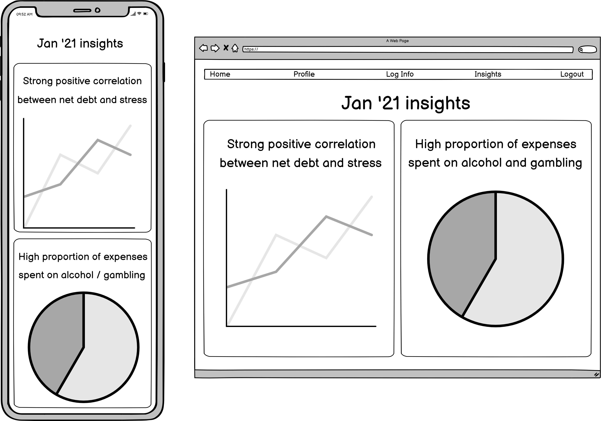


### Activity Page

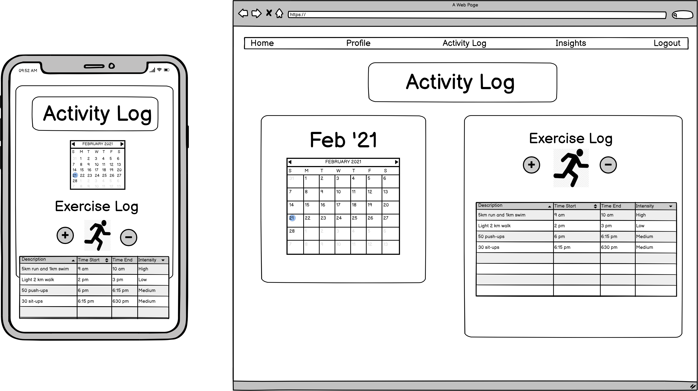


### Contact Specialists Page

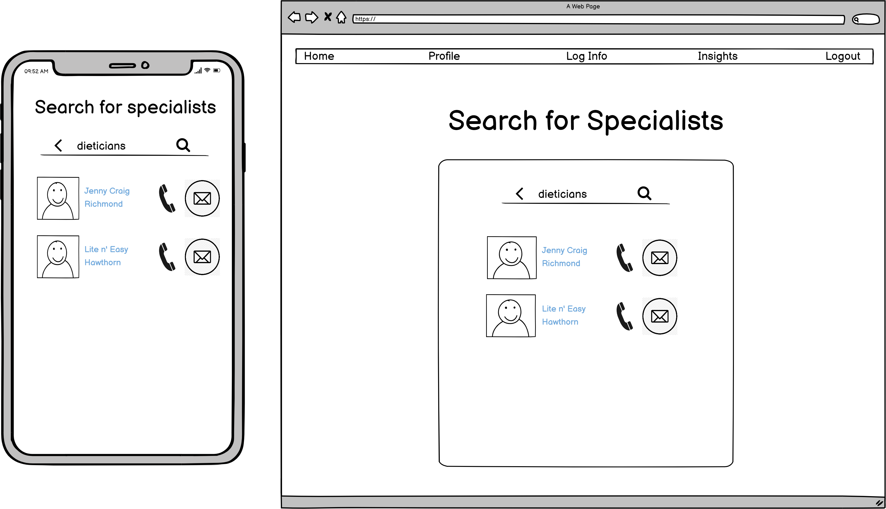


